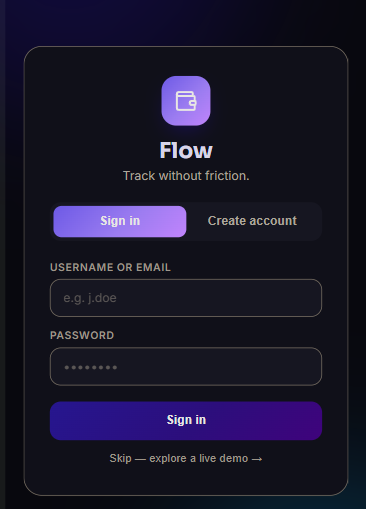
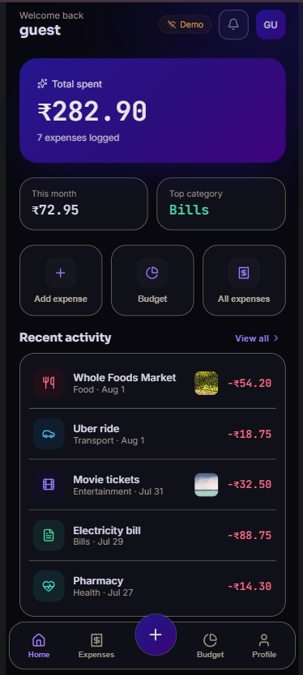
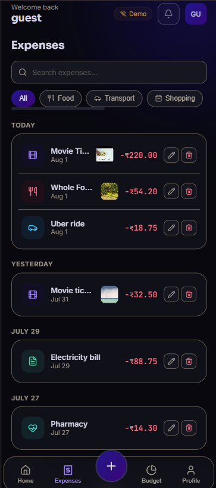
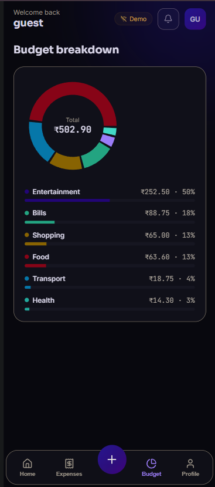
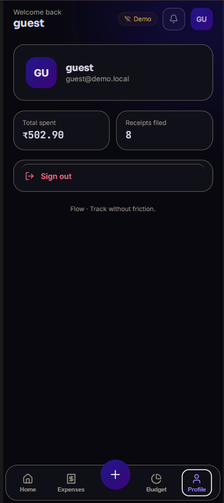
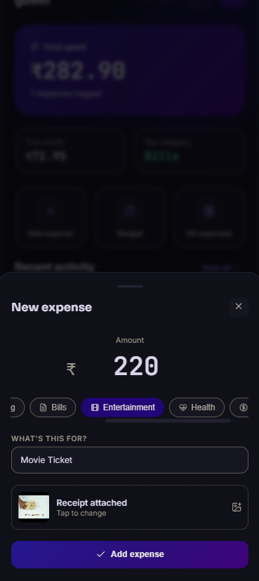
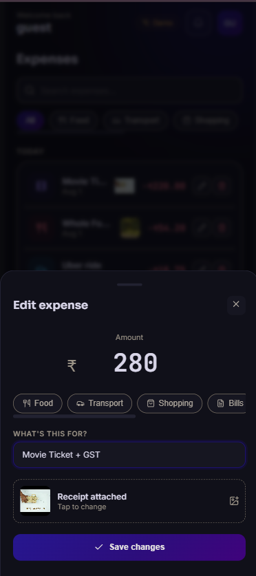
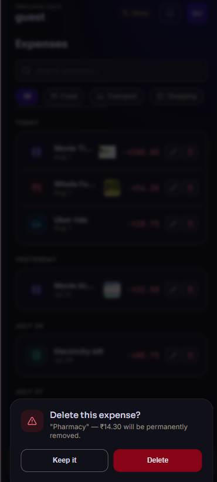
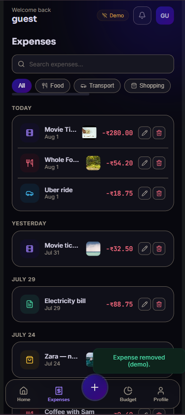
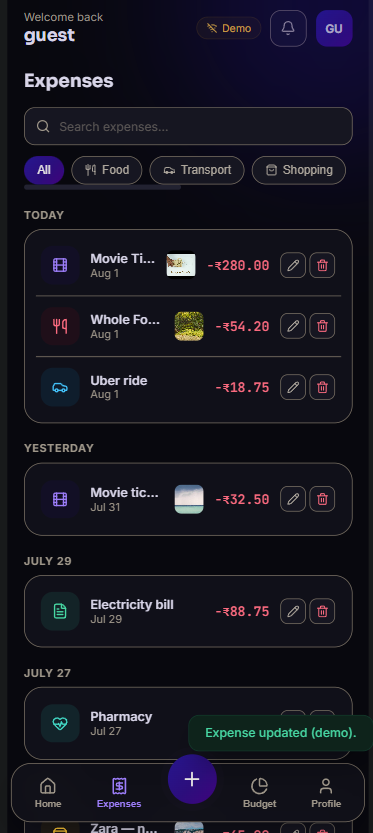

<div align="center">

# 💸 Flow — Personal Expense Tracker

**Track your spending without the friction.**

A full-stack MERN expense tracker with receipt uploads, category breakdowns, and a demo mode that works even without a backend.

[](https://react.dev/)
[](https://vitejs.dev/)
[](https://expressjs.com/)
[](https://www.mongodb.com/)
[](#license)

</div>

---

## Overview

Flow is a personal finance app for logging day-to-day expenses, attaching receipt photos, and understanding where your money goes. It's built as two independent apps — a React SPA and a REST API — so either can be deployed, tested, or replaced on its own.

If the API is unreachable, the frontend automatically falls back to a **live demo mode** with sample data, so the UI can always be explored even without a running backend.

## ✨ Features

- **JWT authentication** — register/login with hashed passwords (bcrypt) and an httpOnly cookie session
- **Expense CRUD** — add, edit, and delete expenses with title, amount, and category
- **Receipt uploads** — attach a photo to any expense, stored via ImageKit
- **Dashboard** — animated total, this-month spend, top spending category, and recent activity
- **Category breakdown** — interactive donut chart of spend by category (Recharts)
- **Search & filter** — full-text search and category filters on the expenses list
- **Responsive UI** — mobile-first with bottom tab navigation, switching to a sidebar layout on desktop
- **Demo mode** — a no-backend fallback so the app is always explorable

## 🧱 Tech Stack

**Frontend**
- React 19 + Vite
- Recharts (charts)
- lucide-react (icons)
- Plain CSS (custom design system, no UI framework)

**Backend**
- Node.js + Express 5
- MongoDB + Mongoose
- JWT (`jsonwebtoken`) for auth, `bcrypt` for password hashing
- Multer + ImageKit for receipt image uploads
- `cookie-parser`, `cors`, `dotenv`

## 📸 Screenshots

<div align="center">

### Login



### Dashboard / Home



### Expenses List



### Budget Breakdown



### Profile



<br/>

| Add Expense | Edit Expense |
|:---:|:---:|
|  |  |

| Delete Expense | Success Toast |
|:---:|:---:|
|  |  |



</div>

> Screenshots live in [`/screenshots`](./screenshots) at the repo root — replace them any time by dropping in new PNGs with the same filenames.

## 📁 Project Structure

```
expense-tracker/
├── backend/
│   ├── server.js                 # entry point — connects DB, starts server
│   └── src/
│       ├── app.js                # Express app, middleware, route mounting
│       ├── controller/           # auth & expense request handlers
│       ├── db/                   # MongoDB connection
│       ├── middleware/           # JWT auth middleware
│       ├── model/                # Mongoose schemas (user, expense)
│       ├── routes/                # /api/auth, /api/expense routers
│       └── service/               # ImageKit upload service
│
├── frontend/
│   └── src/
│       ├── pages/                # Dashboard, Expenses, Budget, Profile, Login
│       ├── components/           # layout, expense, ui, and common components
│       ├── hooks/                # custom hooks (e.g. animated count-up)
│       ├── utils/                # formatters, categories, demo data
│       └── styles/                # global design tokens & responsive layout
│
└── screenshots/                  # app screenshots used in this README
```

## 🚀 Getting Started

### Prerequisites

- [Node.js](https://nodejs.org/) 18+
- A [MongoDB](https://www.mongodb.com/) instance (local or [Atlas](https://www.mongodb.com/atlas))
- An [ImageKit](https://imagekit.io/) account (free tier works) for receipt image uploads

### 1. Clone the repo

```bash
git clone https://github.com/Mehul-vaishnav01/personal-expense-tracker.git
cd personal-expense-tracker
```

### 2. Backend setup

```bash
cd backend
npm install
```

Create a `.env` file in `backend/`:

```env
MONGO_URI=your_mongodb_connection_string
JWT_SECRET=your_jwt_secret
IMAGEKIT_PRIVATE_KEY=your_imagekit_private_key
```

Start the server:

```bash
node server.js
```

The API runs on **http://localhost:3000**.

### 3. Frontend setup

In a new terminal:

```bash
cd frontend
npm install
npm run dev
```

The app runs on **http://localhost:5173** and talks to the backend at `http://localhost:3000/api` by default (configurable from the Profile tab, or by editing `apiBase` in `App.jsx`).

> **No backend running?** No problem — the app detects the failed connection and drops into demo mode automatically, using local sample data.

## 🔌 API Reference

Base URL: `/api`

| Method | Endpoint             | Description                          | Auth required |
|--------|-----------------------|---------------------------------------|:--------------:|
| POST   | `/auth/register`      | Create a new account                 | ❌ |
| POST   | `/auth/login`         | Log in and receive a session cookie  | ❌ |
| POST   | `/auth/logout`        | Clear the session cookie             | ✅ |
| GET    | `/expense/`           | List all expenses for the current user | ✅ |
| GET    | `/expense/:id`        | Get a single expense                 | ✅ |
| POST   | `/expense/add`        | Create an expense (multipart, optional `file`) | ✅ |
| PATCH  | `/expense/update/:id` | Update an expense (multipart, optional `file`) | ✅ |
| DELETE | `/expense/delete/:id` | Delete an expense                    | ✅ |

Authenticated requests rely on an httpOnly `token` cookie set at login/register, so requests from the frontend must be made with `credentials: "include"`.

## 🗺️ Roadmap

- [ ] Budgets & spending limits per category
- [ ] Monthly/yearly trend charts
- [ ] CSV/PDF export of expenses
- [ ] Multi-currency support
- [ ] Password reset flow

## 🤝 Contributing

Contributions, issues, and feature requests are welcome.

1. Fork the project
2. Create your feature branch (`git checkout -b feature/amazing-feature`)
3. Commit your changes (`git commit -m "Add amazing feature"`)
4. Push to the branch (`git push origin feature/amazing-feature`)
5. Open a Pull Request

## 📄 License

This project is licensed under the [MIT License](LICENSE).

---

## 👤 Author

<div align="center">

### Mehul Vaishnav

[](https://github.com/Mehul-vaishnav01)
[](www.linkedin.com/in/mehul-vaishnav-4a255a308)

*If you found this project useful, consider giving it a ⭐ on GitHub!*

</div>
